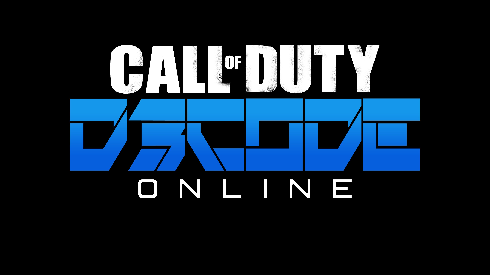

# D3codeTranslations
Translations for COD:OL, requires ProjectD3code.

## ProjectD3code
- Download from [Releases](https://github.com/dtzxporter/ProjectD3code/releases) (Or build from source)

## Download links (Rename to TranslationsDB.db)
- English [Download](https://github.com/dtzxporter/D3codeTranslations/blob/master/en/en_source.db)

## Contributing
- Modify the source.txt file for the language.
- Run `gen.bat` before making a pull request (REQUIRED)

## Credits
- DTZxPorter
- Convery
- Exofile
- Koan
- Sal (Artwork)

## Notice
THE SOFTWARE IS PROVIDED "AS IS", WITHOUT WARRANTY OF ANY KIND, EXPRESS OR IMPLIED, INCLUDING BUT NOT LIMITED TO THE WARRANTIES OF MERCHANTABILITY, FITNESS FOR A PARTICULAR PURPOSE AND NONINFRINGEMENT. IN NO EVENT SHALL THE AUTHORS OR COPYRIGHT HOLDERS BE LIABLE FOR ANY CLAIM, DAMAGES OR OTHER LIABILITY, WHETHER IN AN ACTION OF CONTRACT, TORT OR OTHERWISE, ARISING FROM, OUT OF OR IN CONNECTION WITH THE SOFTWARE OR THE USE OR OTHER DEALINGS IN THE SOFTWARE. USE AT YOUR OWN RISK.